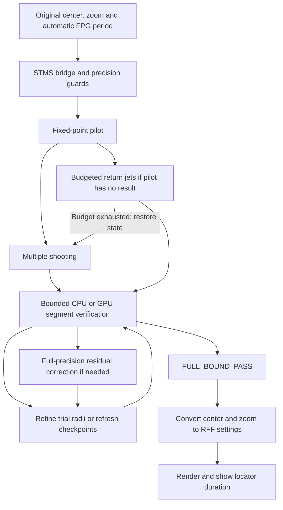

<!-- Created by GPT-6 on 2026-09-10 -->
<!-- Modified by GPT-6 on 2026-09-12 -->
# Locate Minibrot: integrated v202 implementation

This description follows the structure and equations in superfractal's [algorithm repository, About the Algorithm](https://github.com/superfractal/algorithm/blob/90a006d45e88b204b0ab9b8f5d0c18d7ea928a79/About_the_Algorithm.md), checked at commit `90a006d45e88b204b0ab9b8f5d0c18d7ea928a79` on 2026-09-12. That document describes RFF commit `dd8f1c3`; the sections below retain the later v197–v202 integer, GPU, dispatch and bounded-derivative changes present in this Release.

The [consolidated references](#10-consolidated-references) identify sources and their specific use. The [source index](SOURCES_AND_REFERENCES.md) maps them to implementation files. The [historical STMS-RJ description](LOCATE_MINIBROT_STMS_RJ_ALGORITHM.md) is retained for the original proposal and differs from the current integration.

## 1. Change in behavior

Previously, Locate Minibrot refined the center through the existing render/perturbation machinery and searched the display zoom by repeated escape/maximum-iteration checks with decreasing zoom increments. It returned render data.

Now [MB2Locator.cpp](src/rff2/mb/MB2Locator.cpp) calls [STMSBridge.cpp](src/rff2/mb/STMSBridge.cpp), obtains a candidate from sensitivity-tapered multiple shooting or cached return jets, and requires a separate bounded full-precision verification. It returns settings and `dcMax` without constructing a replacement render-data object inside the locator. The UI subsequently requests recomputation.

FPG's `reference->longestPeriod()` remains the authoritative period. This change does not replace FPG, MPA, reference compression, or the Mandelbrot renderer. Old center/zoom helper functions remain in the source but are no longer the normal `locateMinibrot` path.



## 2. Mathematical target and size

For a complex parameter `c`, define the critical orbit and parameter derivative:

```text
z_0 = 0                    D_0 = 0
z_(n+1) = z_n^2 + c         D_(n+1) = 2 z_n D_n + 1
F_p(c) = z_p(c)
```

The nucleus search solves `F_p(c) = 0` for the supplied FPG period `p`. Newton's parameter correction is `delta_c = -z_p / D_p`.

For size calculations, the code also tracks

```text
A = product(2 z_j, j = 1 ... p-1)
D = D_p
```

The local quadratic return map motivates the parameter scale `A D delta_c`. The integrated display convention uses `log10|A D| + 2`. This is a local derivative-based framing convention; it does not reproduce the old escape-based zoom search step by step.

Earlier local development explicitly consulted Claude Heiland-Allen's [Nucleus](https://mathr.co.uk/web/m-nucleus.html) and [Deriving the size estimate](https://mathr.co.uk/blog/2016-12-24_deriving_the_size_estimate.html). The latter's `1/(beta*Lambda^2)` scale is algebraically equivalent to `1/(A*D)`. The [reference index](SOURCES_AND_REFERENCES.md) records this recovered attribution and distinguishes that mathematical background from the later local verification implementation.

Solving `F_p=0` alone does not prove that `p` is the least period: roots of lower periods dividing `p` also satisfy that equation. The application uses its FPG input and numerical acceptance conditions; the call path does not run a general proper-divisor exclusion proof or prove that this is the globally nearest nucleus.

## 3. Precision and input guards

[STMSLimits.hpp](src/rff2/mb/STMSLimits.hpp) allocates, for input decimal log zoom `Z`,

```text
P = ceil((2 Z + 160) log2(10)) bits
P_max = INT_MAX / 32
Z_max = floor((P_max / log2(10) - 160) / 2)
E_limit(P) = max(1,000,000, 2 P + 1,024)
```

The bridge accepts finite `0 <= Z <= Z_max`, periods `1..100,000,000`, and clamps requested proposal threads to `1..64`. The limit is derived from kernel integer capacity rather than a particular fixture's zoom. It is not a performance or memory guarantee at that limit. The verifier additionally checks MPFR exponent range, finite states, and integer conversion bounds.

The proposal uses GMP `mpf_t` for high-precision complex values, `mpz_t` fixed-point orbit kernels, and exponent-extended low-cost derivative estimates. CPU verification retains a uniform `P`-bit MPFR orbit; the GPU verifier uses a fixed-point orbit with `P+128` fractional bits and accounts for conversion and truncation. Local derivative centers may use 192-bit MPFR arithmetic with explicit outward radii, then enter full-P composition. This bounded representation does not lower orbit or returned-center precision, and a proposal alone never authorizes acceptance.

## 4. Pilot and dispatch

[numerics.inc](src/rff2/mb/prototype/numerics.inc) evaluates a fixed-point pilot and saves orbit/derivative checkpoints every 256 iterations. With a supplied period, it stops at that period; the standalone prototype's heuristic `|z_n/D_n| < 32 * 10^(-Z)` is not the normal integrated period selector.

The current pilot cap is:

- For `Z < 500`: the supplied period if it is at most 8,000,000; otherwise 100,000 steps.
- For `Z >= 500`: 100,000,000 steps.

If the pilot returns a period, `solve` chooses multiple shooting. If it returns no period at low zoom, it calls `solve_jets`. For the integrated known-period route, v201 gives each jet build/replay attempt a 1.5-second dispatch budget, polled every 32 outer-loop visits. Exhaustion discards partial maps, restores the original parameter, and runs the full known-period direct pilot/multiple-shooting proposal. The budget is a workload heuristic, not a hard real-time guarantee. A high-zoom pilot failure is rejected. The fast cached-return route remains available when its attempts complete within the budget.

v200 checks pilot completion before saving a checkpoint. Thus a terminal index divisible by 256 is not treated as another segment start; empty terminal segments remain invalid.

## 5. Sensitivity-tapered multiple shooting

### Precision placement and partitioning

If `L_n` estimates accumulated log2 sensitivity, the fixed-point fractional precision follows approximately

```text
b_n = clamp(64 * ceil((goalBits - L_n + 64) / 64), 128, allocatedBits)
```

The code rescales integer state and parameter representations as precision changes. v201 bounds the floating-point precision estimate before converting it to an integer: a sufficiently large finite requirement selects full available precision, while nonfinite estimates are rejected. Near `c=-2`, a coordinate-dependent special path separates an integer part from a small residual to avoid costly arithmetic dominated by the integer component.

The [integer-square helper](src/rff2/mb/prototype/integer_square.hpp), introduced in v197 from the user's proposal, conditionally computes the exact real part as `(x+y)(x-y)` and the imaginary product as `xy`. It is selected only when both GMP magnitudes occupy at least eight limbs and their limb counts are sufficiently close; otherwise it uses the original two squares. Callers retain the original toward-zero shifts, including the factor two in the imaginary shift. This integer identity does not change the truncation points.

The default number of proposal blocks is `8 * threads` below period 100,000, or `12 * threads` otherwise, limited by available pilot points. [partition.inc](src/rff2/mb/prototype/partition.inc) balances estimated work using `segmentLength * bits * sqrt(bits)`. This weight affects scheduling, not mathematical acceptance.

### Coupled correction

For block `i`, with starting state `s_i`, evaluate its endpoint `f_i`, start-state derivative `a_i`, parameter derivative `b_i`, and connection residual:

```text
r_i = f_i(s_i,c) - s_(i+1)
```

The first and final boundary states are zero. OpenMP evaluates blocks independently. A serial composition then solves the linearized boundary equations:

```text
t_0 = u_0 = 0
t_(i+1) = a_i t_i + r_i
u_(i+1) = a_i u_i + b_i
delta_c = -t_m/u_m
delta_s_i = t_i + u_i delta_c
```

Both the parameter and interior boundary states are updated. Correcting only `c` while leaving independent block starts unchanged would not enforce the original connected critical orbit.

The pilot sets an accuracy target `max(Z+25, log10|A D|+18)`. Later goals depend on correction size and estimated curvature, with increasing derivative/state precision. Convergence requires both the parameter correction and sensitivity-normalized interior corrections to be below the target, at sufficient goal precision. The implementation permits 19 post-pilot loop iterations, then throws on failure. Its internal inexpensive final evaluation is still proposal machinery; MPFR verification is required afterward.

For sufficiently deep inputs, [gpu_search.inc](src/rff2/mb/prototype/gpu_search.inc) can accelerate only that existing final sweep with inexpensive derivative estimates. It checks device/range/workload suitability and retains CPU fallback. Higher-precision proposal derivative sweeps still use the CPU kernel. This candidate GPU route is separate from the bounded GPU verifier below.

## 6. Cached Taylor return jets

[return_jets.inc](src/rff2/mb/prototype/return_jets.inc) sets **`ORDER=20`**, rather than the attachment document's degree 24.

Because the first state dependence is even, use `w=z_initial^2`. Store truncated polynomials `S(w)` for a return state and `B(w)` for its parameter derivative. Initially `S=c+w`, `B=1`. A direct step is

```text
S_new = S^2+c
B_new = 2 S B+1
```

For a cached map `M`, composition uses

```text
W = S^2
S_new = M.S(W)
B_new = 2 S M.S'(W) B + M.B(W)
```

New record-small orbit returns can create maps. Maps carry radius/amplitude estimates from positive majorants; implementations store these quantities logarithmically. With a domain ratio `q=|w|/R`, the truncation estimate has the form `L q^(K+1)/(1-q)`, `K=20`. Acceptance also scales estimated state error by parameter sensitivity and prevents jumping beyond the supplied period.

Maps can be reused after a Newton correction by linearizing their parameter dependence around `c0`:

```text
M_c(w) approximately M_c0(w) + (c-c0) * partial_c M_c0(w)
```

The reuse error estimate includes both `q^(K+1)` and `s^2`, where `s=|c-c0|/R`, divided by `(1-q)(1-s)`. If a large map fails the test, smaller maps are tried and a direct step remains available. Maps are rebuilt when displacement or required accuracy makes reuse unsuitable. Polynomial products/compositions use independent coefficient work with thread-private arithmetic storage.

`solve_jets` permits up to 15 correction iterations and also captures checkpoint states for verification. These Taylor and parameter-reuse tests are estimates, not outward-rounded proofs. Cached maps and corrected checkpoint seeds are proposals, never sufficient acceptance evidence by themselves.

## 7. Independent bounded verification

The bridge converts the GMP candidate and proposal checkpoints to MPFR, fixes `v4::precision=P`, and invokes [segments.hpp](src/rff2/mb/verified_quality/segments.hpp). CPU and GPU verification evaluate every one of the `p` critical-orbit steps across connected segments, without Taylor jumps or precision tapering. Their arithmetic differs, and each route must carry the errors appropriate to its own representation before the common acceptance tests.

### Orbit disks and rounding

Each segment starts with a disk around a checkpoint. A heuristic sensitivity-based radius chooses its initial size; the heuristic is not treated as a proof. For center `z` and radius `r`, [enclosure.hpp](src/rff2/mb/verified_quality/enclosure.hpp) propagates approximately

```text
r_next <= r (2|z| + r) + bounded arithmetic error
```

For the CPU MPFR orbit, the arithmetic-error term includes the actual kernel's rounded operations. At 4,096 bits and above, complex squaring uses `(x+y)(x-y)` for its real part and `2xy` for its imaginary part, including errors in the rounded sums. Lower precision uses the ordinary square formulation.

[upper.hpp](src/rff2/mb/verified_quality/upper.hpp) represents nonnegative upper bounds using a binary64 mantissa and a separate signed 64-bit exponent. Operations inflate upward. The environment must support IEEE binary64, round-to-nearest, and disabled flush-to-zero/denormals-are-zero. Unsupported environments fail. The bridge compilation disables fast math and floating-point contraction.

### Derivatives and connections

[disks.hpp](src/rff2/mb/verified_quality/disks.hpp) supplies full-P complex disk composition for affine derivative maps `d_out=a*d_in+b`. At high precision, that disk multiplication uses three real products and explicitly accounts for errors in the additional sums.

On the CPU route, v202 [compact_cpu.inc](src/rff2/mb/verified_quality/compact_cpu.inc) normally evaluates the local derivative maps with 192-bit MPFR centers and outward disk radii when `P>192`. The full-P orbit coefficients are converted with their orbit uncertainty and an outward conversion allowance. Multiplication enlarges the radius by `|a| rb + |b| ra + ra rb` plus rounded-operation error; additions have their own allowance. Both CPU derivative routes retain 64-coefficient groups. The compact centers are embedded exactly into full-P composition with their radii. An inconclusive segment or zoom result retries the full-P CPU derivative route; `STMS_COMPACT_CPU=off` selects that route directly. No final connection, residual, or zoom gate is loosened.

Up to 15 `std::jthread` workers process segments. A longest-first ordering is selected only when the estimated makespan improves. This verifier worker limit is separate from the proposal's OpenMP thread count.

After evaluation, every adjacent connection must satisfy

```text
|computed endpoint_i - checkpoint_(i+1)| + endpointRadius_i
    <= initialRadius_(i+1)
```

The first checkpoint is exactly `z_0=0`. These inclusion tests connect independently evaluated segments to one critical orbit rather than trusting approximate cached starts.

### Exact GPU orbit and bounded summaries

The Vulkan route in [gpu_segments.inc](src/rff2/mb/verified_quality/gpu_segments.inc) normally becomes eligible at 262,144 requested bits, subject to device, exponent, precision, and memory guards. [ntt.comp](src/rff2/mb/ntt.comp), [ntt_gpu.hpp](src/rff2/mb/ntt_gpu.hpp), and [orbit_gpu.cpp](src/rff2/mb/orbit_gpu.cpp) implement two-prime integer NTT multiplication with exact CRT reconstruction. The fixed-point orbit uses `F=P+128`; its prescribed component truncations and parameter/start conversions are included in the outward orbit-radius budget. “Exact GPU arithmetic” here means exact integer convolution/reconstruction and the specified fixed-point operations, not an unrounded real orbit.

Up to 32 dependent iterations are submitted together. Every pre-step component supplies its leading eight 16-bit digits, sign, and omitted-digit count. The CPU uses this 128-bit truncation plus an explicit tail bound to propagate derivative disks with 192-bit MPFR centers. The GPU continues with its full F-bit orbit; the summary truncation is not substituted for that orbit. Endpoint conversion back to P-bit MPFR adds its own rounding allowance.

v199 adds workgroup reductions, combined transform-space complex-square outputs, fused radix-4 stages, and overlapping submission with CPU bound updates. Generated variants retain the underlying source notices. GPU failure or insufficient bounds retry CPU verification when the operation has not been cancelled. `STMS_GPU_VERIFY` and `STMS_GPU_SEARCH` are diagnostic dispatch controls, not bypasses of the acceptance tests. GPU locator dispatch is separate from the UI's image-rendering CPU/GPU setting.

### Acceptance and repair

The scaled endpoint residual upper bound must be below `1e-12`. Derivative disks are composed to enclose `A D`; its modulus lower bound must be positive. Outward-rounded bounds on `log10|A D|+2` must be finite, have a positive lower bound, and have width at most `1e-8`. Only then does the verifier return `FULL_BOUND_PASS`; the bridge also requires exactly `p` completed iterations.

If CPU connections narrowly fail, v200 permits at most three trial-radius refinements when the observed excess is at most a factor ten. Affected suffix trial radii are enlarged using outward observed requirements and a factor-two margin, then every segment enclosure is recomputed. These conditions decide whether to retry; they do not establish acceptance. All connections, the residual, and derivative/zoom bounds must still pass with the new radii.

If connections remain unsuccessful, the bridge can refresh checkpoints by a serial full-precision orbit and retry. If the residual bound fails, it can perform up to **eight full-precision Newton corrections** using `quality::evaluateSerial`, refreshing checkpoints and repeating bounded verification after each. These recovery paths are part of the integration; compact/GPU arithmetic does not replace their final verification.

`FULL_BOUND_PASS` is the code's bounded residual/scale acceptance result. This review has not supplied an independent formal proof of the bound implementation, root existence/uniqueness, convergence from every input, or the intended minibrot's visibility. Those stronger claims require separate mathematical or regression evidence.

## 8. Output conversion, cancellation and timing

The bridge returns decimal center strings, period, zoom bounds/midpoint, residual information, and diagnostic timings. [LocatedView.hpp](src/rff2/mb/LocatedView.hpp) stores `float(proposalZoom)+1.5`, converts the center to RFF's fixed-point representation for the selected exponent, and scales

```text
newDcMax = oldDcMax * 10^(oldLogZoom - storedLogZoom)
```

The UI subtracts `MINIBROT_LOG_ZOOM_OFFSET=1.5` to obtain display zoom. The MPFR zoom interval describes the bridge calculation; subsequent float conversion and center serialization are separate rounding steps, so the same interval width must not be claimed for the saved/rendered view without further checking.

The bridge serializes invocations with a mutex because proposal/verification state includes shared caches and precision settings. It checks cancellation while waiting for the mutex, assigns a ten-minute cooperative deadline, polls during long loops, and clears caches on exit. Cancellation returns no locator result. The deadline is checked at polling points, not a hard preemption of each GMP/MPFR operation.

[FnExplore.cpp](src/rff2/app/FnExplore.cpp) measures the locator call with `steady_clock`, then requests a render. [RFF2.cpp](src/rff2/app/RFF2.cpp) consumes the duration once and can show `Done | Locate: ...s` after successful rendering. The recorded locator duration excludes that later render. `Main.cpp` also changes the window title to `RFF_Ultra`.

## 9. Documentation and evidence boundaries

### Numeric type update (2026-09-12)

`fixed_point_decimal.hpp` incorporates Merutilm's GMP-backed arithmetic at
[RFF-2.0 commit c305a990](https://github.com/Merutilm/RFF-2.0/commit/c305a990e71db016217afd3325eecceaa16f920c).
Its multiply/square routines adapt GMP internals; their original notices remain
in the source. Signed `_mp_size` fixes multiplication sign handling. The local
integration also retains checked zero guards for products below the fixed-point
quantum and IEEE double range handling. `fixed_point_complex.hpp` keeps the
existing RFF_Ultra caller API while using the new scalar representation.
This update does not enable the experimental full-precision orbit store or
implement the author's planned orbit-reuse algorithm. FractalShark is a source
for the separate experiments listed below, not for this numeric type update.

| Topic | Historical attachment | Current integrated source |
| --- | --- | --- |
| Period | Heuristic period discovery | Supplied automatic FPG period |
| Return-jet degree | 24 | 20 |
| Low-zoom dispatch | 100,000-step pilot, then jets | Direct pilot where suitable; budgeted jets with restored-state direct fallback |
| Output zoom | Not implemented | Bounded local scale plus RFF framing conversion |
| Final acceptance | Empirical proposal checks | Full-step CPU/GPU orbit bounds and bounded derivative composition |
| CPU derivative storage | Prototype derivative arithmetic | Normally 192-bit local centers with outward radii; full-P fallback |
| Recovery | Prototype correction logic | Trial-radius refinement, checkpoint refresh, and up to eight MPFR Newton corrections |

`interval_solver.hpp` and `inverse_samples.hpp` include earlier experimental solvers and interpolation utilities. Their presence in the include graph does not mean those algorithms are the active nucleus search; the bridge uses their arithmetic/control infrastructure and the explicit paths described above.

Measurements and their test scope are recorded in [LOCATE_MINIBROT_v202.md](LOCATE_MINIBROT_v202.md). This documentation revision does not change the implementation or add benchmark results.

## 10. Consolidated references

Sources used in development, historical experiments and later mathematical comparisons are listed separately. Each entry states its role; later comparison papers are not presented as original implementation sources.

### 10.1 Actual implementation and early project sources

| Source | Use and provenance |
| --- | --- |
| Merutilm, [RFF-2.0 numeric update c305a990](https://github.com/Merutilm/RFF-2.0/commit/c305a990e71db016217afd3325eecceaa16f920c), [fixed_point_decimal.hpp](https://github.com/Merutilm/RFF-2.0/blob/c305a990e71db016217afd3325eecceaa16f920c/src/rff2/calc/fixed_point_decimal.hpp), [fixed_point_complex.hpp](https://github.com/Merutilm/RFF-2.0/blob/c305a990e71db016217afd3325eecceaa16f920c/src/rff2/calc/fixed_point_complex.hpp) | Source of the 2026-09-12 numeric update. The scalar multiplication/square code contains adapted GNU MP implementation code, explicitly identified in the source. Local boundary guards and caller compatibility are described in section 9. |
| Matthew Renzelmann, [FractalShark](https://github.com/mattsaccount364/FractalShark), locally consulted `Notes/FractalShark (1).pdf`, section 14.1; corresponding [reference-orbit notes](https://github.com/mattsaccount364/FractalShark/blob/main/Notes/FractalShark-13-RefOrbit.tex) | Source for the previous-shooting-orbit reuse proposal and local v214 experiment. The notes motivate nonlinear perturbation-based regeneration; the local exact product cache and its budget policy are adaptations. This experiment is not enabled by the numeric update. The consulted local snapshot has no verified upstream commit ID; the public main link is mutable. |
| Matthew Renzelmann, FractalShark, local PDF section 17; corresponding [GPU arithmetic notes](https://github.com/mattsaccount364/FractalShark/blob/main/Notes/FractalShark-17-GpuArithmetic.tex) and [reference-orbit kernel](https://github.com/mattsaccount364/FractalShark/blob/main/HpSharkFloatLib/KernelHpSharkReferenceOrbit_cu.h) | Sources for the v215 NTT fusion and subsequent persistent GPU execution experiments: block-level data locality, fused recurrence products, and orbit/derivative execution. RFF experiments adapt these ideas to Vulkan; this update imports no FractalShark CUDA backend and makes no FractalShark benchmark claim. These references document later experiments, not the origin of v197-v202. |
| superfractal, [algorithm repository](https://github.com/superfractal/algorithm/tree/90a006d45e88b204b0ab9b8f5d0c18d7ea928a79), [About the Algorithm](https://github.com/superfractal/algorithm/blob/90a006d45e88b204b0ab9b8f5d0c18d7ea928a79/About_the_Algorithm.md), [STMS-RJ description](https://github.com/superfractal/algorithm/blob/90a006d45e88b204b0ab9b8f5d0c18d7ea928a79/LOCATE_MINIBROT_STMS_RJ_ALGORITHM.md) | Primary reference for this 2026-09-12 documentation revision; commit pinned above. It documents the earlier integrated method. Its use here is separate from the original ZIP adaptation and subsequent local development. |
| User-supplied `locate_minibrot_experiment.zip`, integrated in local v112 on 2026-09-10; SHA-256 `25a4d9bde0496ffdb6f5e3ba7c79cfaa703a8035a885fe7fd001e56414585750` | Source of the adapted STMS-RJ proposal. Its [historical algorithm description](LOCATE_MINIBROT_STMS_RJ_ALGORITHM.md) and [integration record](LOCATE_MINIBROT_v112.md) are retained. The original ZIP will not be distributed. |
| Merutilm, [RFF-2.0 repository and README](https://github.com/Merutilm/RFF-2.0), [MB2Locator.cpp](https://raw.githubusercontent.com/Merutilm/RFF-2.0/master/src/rff2/mb/MB2Locator.cpp), [CMakeLists.txt](https://raw.githubusercontent.com/Merutilm/RFF-2.0/master/CMakeLists.txt) | The attachment author's stated references for existing renderer and build context. Mutable master URLs; no exact historical benchmark revision was supplied. These are not upstream STMS-RJ implementations. |
| Local `How_to_rff.docx`, sections 2-1, 2-4 and 2-5 | Renderer center-tracking, arbitrary-precision and zoom background recorded in v2. This is local project documentation. |
| Claude Heiland-Allen, [Nucleus](https://mathr.co.uk/web/m-nucleus.html) | Explicitly consulted in early v1–v3 research for the nucleus equation and parameter derivative. No publication date is inferred from a page-update footer. |
| Claude Heiland-Allen, [Deriving the size estimate](https://mathr.co.uk/blog/2016-12-24_deriving_the_size_estimate.html), 24 December 2016 | Explicitly consulted in v1/v2 for local size. The retained `1/(A D)` form is algebraically equivalent to `1/(beta*Lambda^2)`. Later local bounds and framing choices are separately documented. |
| User's two-product complex-square proposal | Actual source of the requested `(x+y)(x-y)` / `xy` rearrangement. An established integer identity, not a new identity claimed by RFF. Implemented in local v197 and `prototype/integer_square.hpp`. |

Local implementation records are also sources, even when no outside paper was consulted:

For the specifically requested **forward NTT -> products -> inverse NTT fusion**,
FractalShark's block-local fused implementation is the design reference. Local
v215 combines the final nine forward stages, pointwise products and first nine
inverse stages in shared memory for each 512-coefficient tile. This is separate
from the older radix-4 fusion. The proposal's 1.2-1.8x estimate referred to
affected GPU work; v215 measured 1.123-1.168x for its GPU orbit component, with
smaller whole-locator gains. These are historical experiment measurements, not
new benchmarks or a claim that this numeric-type update enables that experiment.

| Local lineage | Retained implementation |
| --- | --- |
| v4/v9 interval infrastructure; v17/v18 inverse interpolation; v24 orbit/scale evaluation; v81 family; v76 saved-root diagnostics | `interval_solver.hpp`, `inverse_samples.hpp`, `quality.hpp`, and v112 integration. Retained inactive solvers do not define the current proposal path. |
| v93/v94 orbit disks and scaled positive bounds; v123–v125 checked segments and derivative disks; later work partitioning including v159 | `enclosure.hpp`, `upper.hpp`, `disks.hpp`, `segments.hpp`, `partition.inc`. Local derivations and integration. |
| v197 DESIGN and v198 DESIGN/RESULT | Conditional integer square, local Vulkan runtime adaptation, NTT/CRT, fixed-point orbit and bounded summaries. |
| v199 RESULT and [Release record](LOCATE_MINIBROT_v199.md) | Reductions, transform-space complex products, fused transform stages, overlapping submission/bound updates; generator and fragments. |
| v200 RESULT and [Release record](LOCATE_MINIBROT_v200.md) | Terminal checkpoint ordering and retry-radius repair. |
| v201 RESULT and [Release record](LOCATE_MINIBROT_v201.md) | Budgeted jet dispatch and safe precision conversion. |
| v202 RESULT and [Release record](LOCATE_MINIBROT_v202.md) | Compact CPU derivative centers with explicit outward errors and full-precision fallback, adapted from the local disk/GPU derivative code. |

The paths above beginning with a version name refer to archived local `_local_only/Debug/source/vN/` records. The essential lineage is reproduced here so this bibliography remains useful in a Release-only source package.

### 10.2 Historical method references

These papers were cited by v3. They are not implementation sources for the current active locator or the later unrelated inverse-interpolation routines.

| Reference | Historical relevance |
| --- | --- |
| Francesco Calabrò and Andrea Polsinelli (2016), [How to get high order without loosing efficiency …: A short review of Shamanskii's m method](https://arxiv.org/abs/1609.03328), arXiv:1609.03328 | Shamanskii derivative/factorization reuse background. The title is abbreviated; its original spelling is preserved. |
| Ibrahim Mohammed Sulaiman, Mustafa Mamat and Umar Audu Omesa (2020), [A Shamanskii-Like Accelerated Scheme for Nonlinear Systems of Equations](https://www.intechopen.com/chapters/71158), DOI `10.5772/intechopen.87246` | Historical accelerated nonlinear-system iteration reference. |

### 10.3 Mathematical background checked during the audit

These are audit-time comparisons/background unless otherwise stated. No evidence identifies them as papers consulted when implementing v197–v202. The carry scan uses iterative doubling; the broader Blelloch reference is not a claim that the shader implements his work-efficient up-sweep/down-sweep algorithm.

| Reference | Relevant subject and verification boundary |
| --- | --- |
| Peter L. Montgomery (1985), [Modular Multiplication Without Trial Division](https://class.ece.iastate.edu/tyagi/cpre681/papers/Montgomery.pdf), Mathematics of Computation 44(170), 519–521; DOI `10.1090/S0025-5718-1985-0777282-X` | Montgomery REDC; original paper read through a university-hosted scan. |
| J. M. Pollard (1971), [The Fast Fourier Transform in a Finite Field](https://luca-giuzzi.unibs.it/corsi/Support/papers-cryptography/2004932.pdf), Mathematics of Computation 25(114), 365–374; DOI `10.1090/S0025-5718-1971-0301966-0` | Finite-field convolution, CRT and integer multiplication; original-paper scan inspected. |
| W. Daniel Hillis and Guy L. Steele Jr. (1986), [Data Parallel Algorithms](https://www.cs.utexas.edu/~pingali/CS395T/2009fa/papers/dataParallel.pdf), Communications of the ACM 29(12), 1170–1183; DOI `10.1145/7902.7903` | Iterative-doubling parallel algorithms; original paper inspected. |
| Guy E. Blelloch (1990), [Prefix Sums and Their Applications](https://www.cs.cmu.edu/afs/cs.cmu.edu/project/scandal/public/papers/CMU-CS-90-190.html), CMU-CS-90-190 | General prefix-scan background; author/report metadata checked on the CMU page. |
| Marshall Law and Michael Monagan (2015), [A parallel implementation for polynomial multiplication modulo a prime](https://www.cecm.sfu.ca/~mmonagan/papers/fftPASCO.pdf), PASCO '15; DOI `10.1145/2790282.2790293` | Same numerical NTT prime pair; different implementation structure. |
| James W. Cooley and John W. Tukey (1965), [An Algorithm for the Machine Calculation of Complex Fourier Series](https://scil.usherbrooke.ca/courses/imn359/misc/Cooley_Tukey_1965.pdf), Mathematics of Computation 19(90), 297–301; DOI `10.1090/S0025-5718-1965-0178586-1` | General FFT background. PDF extraction/screenshot access failed in the earlier audit; not used to establish an implementation match. |
| Brian R. Hunt and Edward Ott (1997), *Structure in the parameter dependence of order and chaos for the quadratic map*, Journal of Physics A 30, 7067–7076, cited by Heiland-Allen; [Hunt's publication list](https://terpconnect.umd.edu/~bhunt/research/) | Secondary historical lead. Author bibliography checked; original paper was not read and is not asserted as a directly consulted implementation source. |
| NIST DLMF, [§3.3 Interpolation](https://dlmf.nist.gov/3.3) and [§3.5 Quadrature](https://dlmf.nist.gov/3.5) | Audit comparisons for standard numerical concepts; not recorded as development sources. |
| Claude Heiland-Allen, [mandelbrot-numerics source listing](https://mathr.co.uk/source-codes/mandelbrot-numerics.pdf) | Selected ball-period, nucleus and size sections compared during the audit; not a complete review of the 195-page listing. |
| BifurcationKit, [periodic-orbit shooting documentation](https://github.com/bifurcationkit/BifurcationKitDocs.jl/blob/main/docs/src/periodicOrbitShooting.md) | General multiple-shooting comparison found during searching; no matching implementation identified. |

### 10.4 Supporting APIs and standards

| Reference | Use |
| --- | --- |
| [GNU MP manual](https://gmplib.org/manual/) | `mpz_t` integer and `mpf_t` multiprecision arithmetic; locally inspected version 6.3.0. |
| [GNU MPFR manual](https://www.mpfr.org/mpfr-current/mpfr.html), [rounding modes](https://www.mpfr.org/mpfr-current/mpfr.html#Rounding) | Directed rounding for orbit and derivative bounds; locally inspected version 4.2.2. |
| [LLVM OpenMP](https://openmp.llvm.org/) | CPU proposal blocks and polynomial coefficient parallelism. |
| Khronos, [Vulkan headers 1.4.335](https://raw.githubusercontent.com/KhronosGroup/Vulkan-Headers/v1.4.335/include/vulkan/vulkan_core.h) | GPU compute dispatch, buffers and synchronization API. Shader generation is described in [BUILD_LOCATOR_SHADERS.md](BUILD_LOCATOR_SHADERS.md). |
| NIST, [FIPS 180-4](https://csrc.nist.gov/pubs/fips/180-4/final), sections 4.1.2, 4.2.2, 5.1–5.3 and 6.2 | SHA-256 operations and constants used by the regression helper, outside the locator algorithm. |
| Boost, [ContainerHash documentation and hash-combine history](https://www.boost.org/doc/libs/latest/libs/container_hash/doc/html/hash.html) | Existing Boost-style combination formula in `include/vulkan_helper/hash/BoostHasher.hpp`; exact historical upstream revision is not recorded. |

Project and dependency notices are retained in [LICENSE](LICENSE), [NOTICE](NOTICE) and [THIRD-PARTY-LICENSE](THIRD-PARTY-LICENSE).
