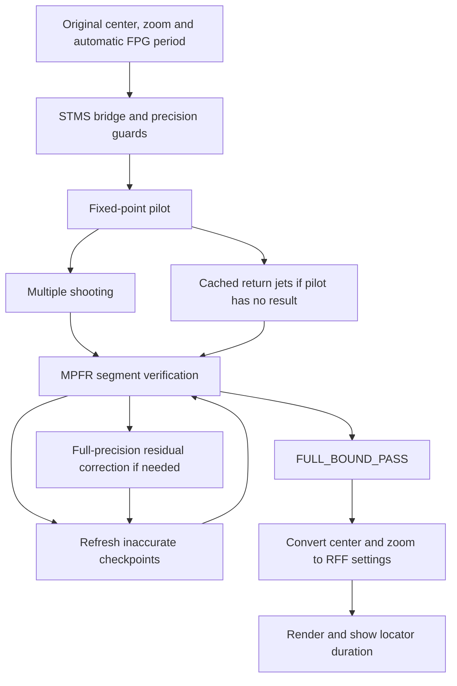

<!-- Created by GPT-6 on 2026-09-10 -->
# Locate Minibrot: integrated implementation at dd8f1c3

This document describes local commit `dd8f1c32bad8cc4429b0c531b27d58731755c849`, compared with `18ea9d716455ea676b7353e1f3c0ae34773f6e8f`. It follows the actual production call path. The older [STMS-RJ attachment document](LOCATE_MINIBROT_STMS_RJ_ALGORITHM.md) describes historical proposal code and remains a provenance reference; several of its details differ from the integrated implementation.

## 1. Change in behavior

Previously, Locate Minibrot refined the center through the existing render/perturbation machinery and searched the display zoom by repeated escape/maximum-iteration checks with decreasing zoom increments. It returned render data.

Now [MB2Locator.cpp](src/rff2/mb/MB2Locator.cpp) calls [STMSBridge.cpp](src/rff2/mb/STMSBridge.cpp), obtains a candidate from sensitivity-tapered multiple shooting or cached return jets, and requires a separate bounded full-precision verification. It returns settings and `dcMax` without constructing a replacement render-data object inside the locator. The UI subsequently requests recomputation.

FPG's `reference->longestPeriod()` remains the authoritative period. This change does not replace FPG, MPA, reference compression, or the Mandelbrot renderer. Old center/zoom helper functions remain in the source but are no longer the normal `locateMinibrot` path.



## 2. Mathematical target and size

For a complex parameter `c`, define the critical orbit and parameter derivative:

```text
z_0 = 0                    D_0 = 0
z_(n+1) = z_n^2 + c         D_(n+1) = 2 z_n D_n + 1
F_p(c) = z_p(c)
```

The nucleus search solves `F_p(c) = 0` for the supplied FPG period `p`. Newton's parameter correction is `delta_c = -z_p / D_p`.

For size calculations, the code also tracks

```text
A = product(2 z_j, j = 1 ... p-1)
D = D_p
```

The local quadratic return map motivates the parameter scale `A D delta_c`. The integrated display convention uses `log10|A D| + 2`. This is a local derivative-based framing convention; it does not reproduce the old escape-based zoom search step by step.

Solving `F_p=0` alone does not prove that `p` is the least period: roots of lower periods dividing `p` also satisfy that equation. The application uses its FPG input and numerical acceptance conditions; the call path does not run a general proper-divisor exclusion proof or prove that this is the globally nearest nucleus.

## 3. Precision and input guards

[STMSLimits.hpp](src/rff2/mb/STMSLimits.hpp) allocates, for input decimal log zoom `Z`,

```text
P = ceil((2 Z + 160) log2(10)) bits
P_max = INT_MAX / 32
Z_max = floor((P_max / log2(10) - 160) / 2)
E_limit(P) = max(1,000,000, 2 P + 1,024)
```

The bridge accepts finite `0 <= Z <= Z_max`, periods `1..100,000,000`, and clamps requested proposal threads to `1..64`. The limit is derived from kernel integer capacity rather than a particular fixture's zoom. It is not a performance or memory guarantee at that limit. The verifier additionally checks MPFR exponent range, finite states, and integer conversion bounds.

The proposal uses GMP `mpf_t` for high-precision complex values, `mpz_t` fixed-point orbit kernels, and exponent-extended low-cost derivative estimates. The acceptance pass uses uniform `P`-bit MPFR values. Reducing proposal arithmetic precision does not authorize accepting an unverified center.

## 4. Pilot and dispatch

[numerics.inc](src/rff2/mb/prototype/numerics.inc) evaluates a fixed-point pilot and saves orbit/derivative checkpoints every 256 iterations. With a supplied period, it stops at that period; the standalone prototype's heuristic `|z_n/D_n| < 32 * 10^(-Z)` is not the normal integrated period selector.

The current pilot cap is:

- For `Z < 500`: the supplied period if it is at most 8,000,000; otherwise 100,000 steps.
- For `Z >= 500`: 100,000,000 steps.

If the pilot returns a period, `solve` chooses multiple shooting. If it returns no period at low zoom, it calls `solve_jets`. A high-zoom pilot failure is rejected. Thus the old statement that every low-zoom period beyond 100,000 immediately dispatches to jets is stale for the integrated code.

## 5. Sensitivity-tapered multiple shooting

### Precision placement and partitioning

If `L_n` estimates accumulated log2 sensitivity, the fixed-point fractional precision follows approximately

```text
b_n = clamp(64 * ceil((goalBits - L_n + 64) / 64), 128, allocatedBits)
```

The code rescales integer state and parameter representations as precision changes. Near `c=-2`, a coordinate-dependent special path separates an integer part from a small residual to avoid costly arithmetic dominated by the integer component.

The default number of proposal blocks is `8 * threads` below period 100,000, or `12 * threads` otherwise, limited by available pilot points. [partition.inc](src/rff2/mb/prototype/partition.inc) balances estimated work using `segmentLength * bits * sqrt(bits)`. This weight affects scheduling, not mathematical acceptance.

### Coupled correction

For block `i`, with starting state `s_i`, evaluate its endpoint `f_i`, start-state derivative `a_i`, parameter derivative `b_i`, and connection residual:

```text
r_i = f_i(s_i,c) - s_(i+1)
```

The first and final boundary states are zero. OpenMP evaluates blocks independently. A serial composition then solves the linearized boundary equations:

```text
t_0 = u_0 = 0
t_(i+1) = a_i t_i + r_i
u_(i+1) = a_i u_i + b_i
delta_c = -t_m/u_m
delta_s_i = t_i + u_i delta_c
```

Both the parameter and interior boundary states are updated. Correcting only `c` while leaving independent block starts unchanged would not enforce the original connected critical orbit.

The pilot sets an accuracy target `max(Z+25, log10|A D|+18)`. Later goals depend on correction size and estimated curvature, with increasing derivative/state precision. Convergence requires both the parameter correction and sensitivity-normalized interior corrections to be below the target, at sufficient goal precision. The implementation permits 19 post-pilot loop iterations, then throws on failure. Its internal inexpensive final evaluation is still proposal machinery; MPFR verification is required afterward.

## 6. Cached Taylor return jets

[return_jets.inc](src/rff2/mb/prototype/return_jets.inc) sets **`ORDER=20`**, rather than the attachment document's degree 24.

Because the first state dependence is even, use `w=z_initial^2`. Store truncated polynomials `S(w)` for a return state and `B(w)` for its parameter derivative. Initially `S=c+w`, `B=1`. A direct step is

```text
S_new = S^2+c
B_new = 2 S B+1
```

For a cached map `M`, composition uses

```text
W = S^2
S_new = M.S(W)
B_new = 2 S M.S'(W) B + M.B(W)
```

New record-small orbit returns can create maps. Maps carry radius/amplitude estimates from positive majorants; implementations store these quantities logarithmically. With a domain ratio `q=|w|/R`, the truncation estimate has the form `L q^(K+1)/(1-q)`, `K=20`. Acceptance also scales estimated state error by parameter sensitivity and prevents jumping beyond the supplied period.

Maps can be reused after a Newton correction by linearizing their parameter dependence around `c0`:

```text
M_c(w) approximately M_c0(w) + (c-c0) * partial_c M_c0(w)
```

The reuse error estimate includes both `q^(K+1)` and `s^2`, where `s=|c-c0|/R`, divided by `(1-q)(1-s)`. If a large map fails the test, smaller maps are tried and a direct step remains available. Maps are rebuilt when displacement or required accuracy makes reuse unsuitable. Polynomial products/compositions use independent coefficient work with thread-private arithmetic storage.

`solve_jets` permits up to 15 correction iterations and also captures checkpoint states for verification. These Taylor and parameter-reuse tests are estimates, not outward-rounded proofs. Cached maps and corrected checkpoint seeds are proposals, never sufficient acceptance evidence by themselves.

## 7. Independent bounded verification

The bridge converts the GMP candidate and proposal checkpoints to MPFR, fixes `v4::precision=P`, and invokes [segments.hpp](src/rff2/mb/verified_quality/segments.hpp). It evaluates every one of the `p` critical-orbit steps across connected segments, without Taylor jumps or precision tapering.

### Orbit disks and rounding

Each segment starts with a disk around a checkpoint. A heuristic sensitivity-based radius chooses its initial size; the heuristic is not treated as a proof. For center `z` and radius `r`, [enclosure.hpp](src/rff2/mb/verified_quality/enclosure.hpp) propagates approximately

```text
r_next <= r (2|z| + r) + bounded arithmetic error
```

The arithmetic-error term includes the actual kernel's rounded operations. At 4,096 bits and above, complex squaring uses `(x+y)(x-y)` for its real part and `2xy` for its imaginary part, including errors in the rounded sums. Lower precision uses the ordinary square formulation.

[upper.hpp](src/rff2/mb/verified_quality/upper.hpp) represents nonnegative upper bounds using a binary64 mantissa and a separate signed 64-bit exponent. Operations inflate upward. The environment must support IEEE binary64, round-to-nearest, and disabled flush-to-zero/denormals-are-zero. Unsupported environments fail. The bridge compilation disables fast math and floating-point contraction.

### Derivatives and connections

[disks.hpp](src/rff2/mb/verified_quality/disks.hpp) propagates complex disk bounds for affine derivative maps `d_out=a*d_in+b`. Coefficients are grouped in batches of 64 to reduce arithmetic overhead. At high precision, disk multiplication uses three real products and explicitly accounts for errors in the additional sums.

Up to 15 `std::jthread` workers process segments. A longest-first ordering is selected only when the estimated makespan improves. This verifier worker limit is separate from the proposal's OpenMP thread count.

After evaluation, every adjacent connection must satisfy

```text
|computed endpoint_i - checkpoint_(i+1)| + endpointRadius_i
    <= initialRadius_(i+1)
```

The first checkpoint is exactly `z_0=0`. These inclusion tests connect independently evaluated segments to one critical orbit rather than trusting approximate cached starts.

### Acceptance and repair

The scaled endpoint residual upper bound must be below `1e-12`. Derivative disks are composed to enclose `A D`; its modulus lower bound must be positive. Outward-rounded bounds on `log10|A D|+2` must be finite, have a positive lower bound, and have width at most `1e-8`. Only then does the verifier return `FULL_BOUND_PASS`; the bridge also requires exactly `p` completed iterations.

If connections fail, the bridge refreshes checkpoints by a serial full-precision orbit and retries. If the residual bound fails, it can perform up to **eight full-precision Newton corrections** using `quality::evaluateSerial`, refreshing checkpoints and repeating bounded verification after each. This correction path is present in the integrated implementation and should not be omitted from its description.

`FULL_BOUND_PASS` is the code's bounded residual/scale acceptance result. This review has not supplied an independent formal proof of the bound implementation, root existence/uniqueness, convergence from every input, or the intended minibrot's visibility. Those stronger claims require separate mathematical or regression evidence.

## 8. Output conversion, cancellation and timing

The bridge returns decimal center strings, period, zoom bounds/midpoint, residual information, and diagnostic timings. [LocatedView.hpp](src/rff2/mb/LocatedView.hpp) stores `float(proposalZoom)+1.5`, converts the center to RFF's fixed-point representation for the selected exponent, and scales

```text
newDcMax = oldDcMax * 10^(oldLogZoom - storedLogZoom)
```

The UI subtracts `MINIBROT_LOG_ZOOM_OFFSET=1.5` to obtain display zoom. The MPFR zoom interval describes the bridge calculation; subsequent float conversion and center serialization are separate rounding steps, so the same interval width must not be claimed for the saved/rendered view without further checking.

The bridge serializes invocations with a mutex because proposal/verification state includes shared caches and precision settings. It checks cancellation while waiting for the mutex, assigns a ten-minute cooperative deadline, polls during long loops, and clears caches on exit. Cancellation returns no locator result. The deadline is checked at polling points, not a hard preemption of each GMP/MPFR operation.

[FnExplore.cpp](src/rff2/app/FnExplore.cpp) measures the locator call with `steady_clock`, then requests a render. [RFF2.cpp](src/rff2/app/RFF2.cpp) consumes the duration once and can show `Done | Locate: ...s` after successful rendering. The recorded locator duration excludes that later render. `Main.cpp` also changes the window title to `RFF_Ultra`.

## 9. Documentation and evidence boundaries

| Topic | Historical attachment | Current integrated source |
| --- | --- | --- |
| Period | Heuristic period discovery | Supplied automatic FPG period |
| Return-jet degree | 24 | 20 |
| Low-zoom pilot cap | 100,000 | Supplied periods up to 8,000,000 can run directly |
| Output zoom | Not implemented | Bounded local scale plus RFF framing conversion |
| Final acceptance | Empirical proposal checks | Full-step MPFR segment bounds |
| Recovery | Prototype correction logic | Checkpoint refresh and up to eight MPFR Newton corrections |

`interval_solver.hpp` and `inverse_samples.hpp` include earlier experimental solvers and interpolation utilities. Their presence in the include graph does not mean those algorithms are the active nucleus search; the bridge uses their arithmetic/control infrastructure and the explicit paths described above.

This was a source/documentation review. No numerical benchmark, GUI visibility check, or SHA-256 render regression was rerun. Historical timings in [LOCATE_MINIBROT_v112.md](LOCATE_MINIBROT_v112.md) remain historical evidence, not newly verified timings for HEAD. This document makes no claim that the separate 10x/2x research targets have been achieved. 